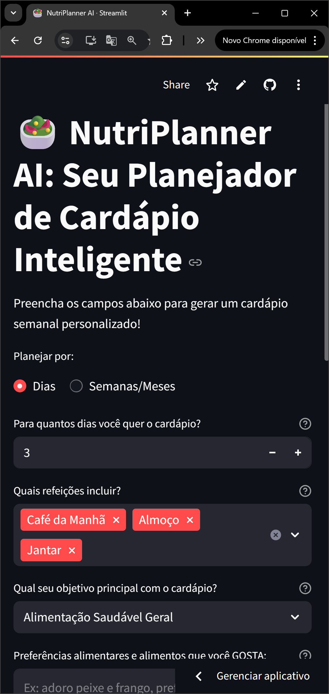
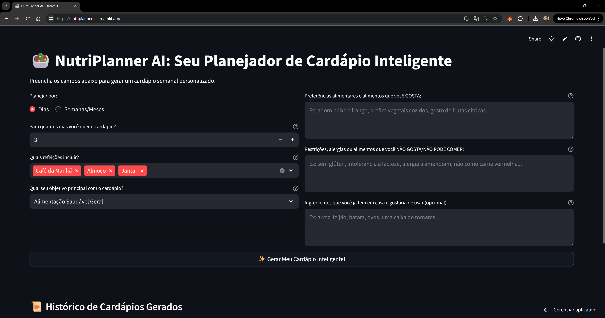

# NutriPlanner AI 🥗

Seu Planejador de Cardápio Semanal Inteligente, desenvolvido com Streamlit e a API do Google Gemini.

**Acesse o NutriPlanner AI aqui:** [https://nutriplannerai.streamlit.app/](https://nutriplannerai.streamlit.app/)

## Screenshots da Aplicação

Aqui estão algumas visualizações do NutriPlanner AI em ação:

<table>
  <tr>
<td><strong>Visualização Mobile (ou Detalhe dos Inputs):</strong></td>

<td><strong>Interface Principal (Desktop):</stron></td>

  </tr>
</table>

## Descrição

O NutriPlanner AI ajuda usuários a criar cardápios semanais personalizados com base em seus objetivos (alimentação saudável, perda de peso, controle de diabetes, etc.), preferências alimentares, restrições e ingredientes disponíveis em casa. Ele também pode fornecer uma lista de compras sugerida.

## Funcionalidades

- Planejamento de cardápio por dias ou semanas.
- Seleção de refeições a incluir.
- Consideração de objetivos de saúde, incluindo opções para diabéticos e hipertensos.
- Inputs para preferências, restrições e ingredientes já disponíveis.
- Geração de lista de compras sugerida.
- Histórico de cardápios gerados na sessão.
- Alertas sobre alimentos contraindicados (quando detectado pela IA).

## Como Configurar e Rodar Localmente

1.  **Clone o repositório:**

    ```bash
    git clone https://github.com/SEU_USUARIO/NutriPlannerAI.git
    cd NutriPlannerAI
    ```

2.  **Crie e ative um ambiente virtual:**

    ```bash
    # No Windows (usando py launcher)
    py -m venv .venv
    .\.venv\Scripts\Activate.ps1

    # No Linux/macOS
    # python3 -m venv .venv
    # source .venv/bin/activate
    ```

3.  **Instale as dependências:**

    ```bash
    pip install -r requirements.txt
    ```

4.  **Configure sua API Key:**

    - Crie um arquivo chamado `.env` na raiz do projeto.
    - Adicione sua API Key do Google AI Studio (Gemini):
      ```
      GOOGLE_API_KEY="SUA_API_KEY_AQUI"
      ```

5.  **Execute a aplicação Streamlit:**
    ```bash
    streamlit run app.py
    ```

## Tecnologias Utilizadas

- Python
- Streamlit
- Google Generative AI (Gemini API)
- python-dotenv

## Desenvolvido para

Imersão IA da Alura (Edição 3 - Ano 2025)
